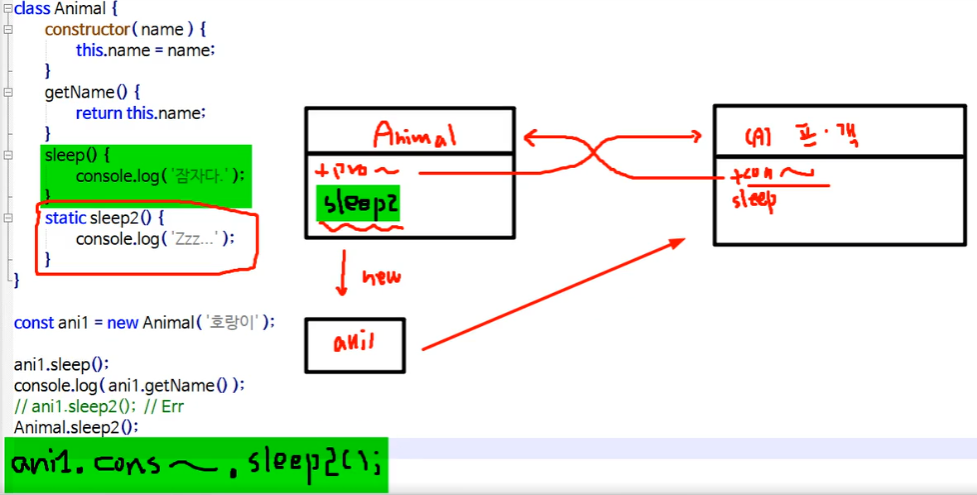

# 4. 정적 메서드 
## 4-1. 유틸리티 만들 때 주로 사용한다.
유틸리티 클래스는 상태를 가지고 있지 않는 클래스라고 봐도 무방하다.

<br >

## 4-2. 정적 메서드의 기준
-> 인스턴스(객체)가 생성되지 않아도, `특정 메서드를 호출`할 수 있어야 한다.
* 유틸리티 클래스로 작성되고, 변화를 가정하지 않음.
* 메소드가 인스턴스 변수를 사용하지 않는다.
* 인스턴스 생성에 의존하지 않는다.
* 메서드가 공유되고 있다면, 정적 메서드로 추출할 수 있다.
* 메소드가 변화되지 않고, 오버라이딩 되지 않는다.

<br >

## 4-3. 포인트
1. 어떻게 정적 메서드를 구현하는지?
2. `정적 메서드는 어떤 경우에 호출`되고, 어떤 경우에 호출되지 않는지
    * static 키워드가 붙은 메서드의 경우는 인스턴스가 아닌 `클래스명으로 호출`한다.
3. 인스턴스(객체)가 정적 메서드를 호출할 수 있는지 없는지에 대한 이해도 필요.
   -> 결론, 호출은 가능하다.

### [1] : 정적 메서드 (Static Methods)
* 메서드 앞에 `static` 키워드를 붙인다면 -> 따로 인스턴스(객체)를 생성하지 않아도 메서드 호출이 가능.
* 인스턴스를 통해서 호출하는 것은 불가능.

  ```js
  // 일반적인 메서드 호출 방식
  {객체명}.{메서드명}() 
  ```
  
  ```js
  // 정적 메서드 호출 방식
  {class명}.{static이붙은정적메서드명}() // - O 1) 클래스로만 호출 가능

  {객체명}.{static이붙은정적메서드명}() // - X 2-1) 인스턴스로 호출 불가
  {객체명}.constructor.{static이붙은정적메서드명}() // - O 2-2) constructor로 호출 가능
  ```

  (결론) 인스턴트에 따라 달라지지 않는 고정된 메서드를 정적 메서드라고 한다.


### [1-1] 실습

```js
// [static 메서드 사용법]
// 1. 클래스명.정적메서드() -> 클래스로만 호출할 수 있다.
// 2. 인스턴스로 호출 불가 -> constructor로는 호출 가능
class Animal {
  constructor(name) {
    this.name = name;
  }

  getName() {
    return this.name;
  }

  sleep() {
    // Animal Prototype Object에 존재함.
    return '잠자다';
  }

  // 정적 메서드 sleep2
  static sleep2() {
    // Animal 객체에 존재함.
    console.log('Zzz...');
  }
}

const ani1 = new Animal('호랑이');
console.log(ani1.sleep()); // 잠자다
console.log(ani1.getName()); // 호랑이

// ani1.sleep2(); 
// // Error --> 인스턴스(객체)를 통해서는 호출할 수 없다.
// // --> 인스턴스를 통해 호출이 가능하려면 constructor사용

Animal.sleep2(); // Zzz..., 정적 메서드는 class명으로 호출한다.
ani1.constructor.sleep2(); // Zzz..., 인스턴스를 통해 호출하기 위해 constructor사용.
```


<br >
<br >
<br >

### [2] 상속 관계에서의 정적 메서드
```js
class Add {
  static plus(x) {
    x = x || 100;
    return x + 1000;
  }
}

class ChildAdd extends Add {
  static plus(x) {
    return super.plus(x) + super.plus(x) + super.plus(x);
  }
}

// console.log(Add.plus()); // 1100
// console.log(Add.plus(500)); // 1500
// console.log(ChildAdd.plus()); // 3300
// console.log(ChildAdd.plus(300)); // 3900

const add1 = new Add();
// console.log(add1.plus()); // Err
console.log(add1.constructor.plus()); // 1100
console.log(add1.constructor.plus(30)); // 1030

const add2 = new ChildAdd();
// console.log(add2.plus()); // Err
console.log(add2.constructor.plus()); // 3300

```
