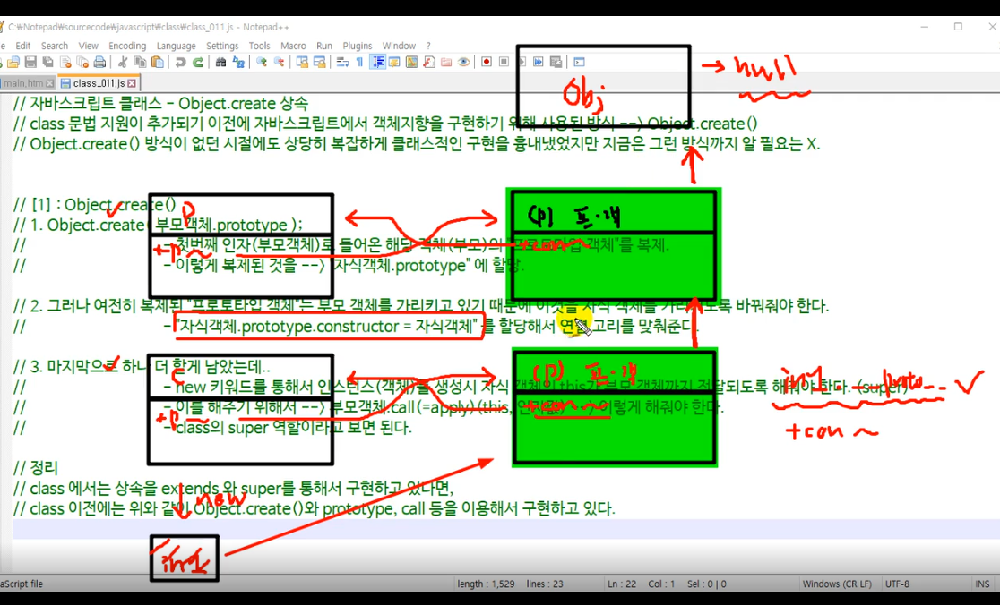
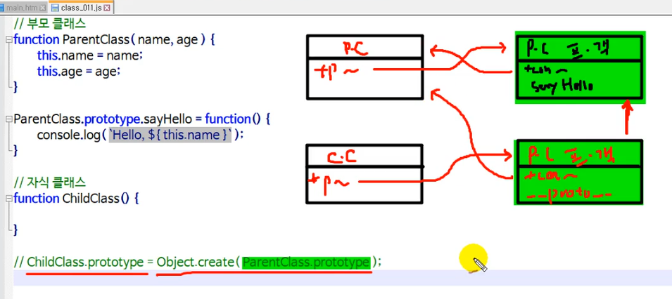
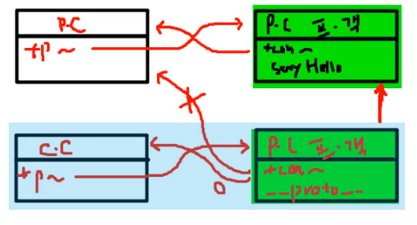
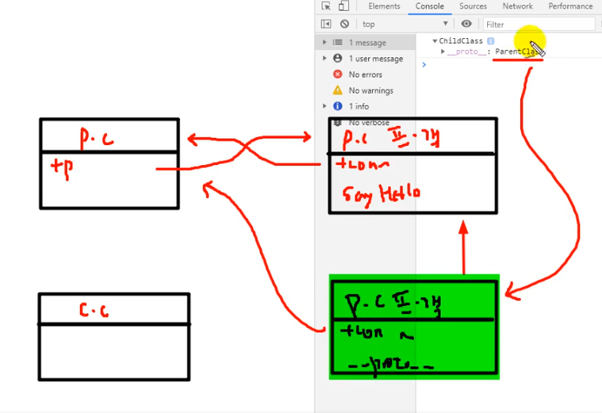

# Object.create 상속
1. class 문법 지원이 추가되기 이전에 자바스크립트에서 객체 지향을 구현하기 위해 사용된 방식 --> `Object.create()`
2. `Object.create()` 방식이 없던 시절에도 상당히 복잡하게 클래스적인 구현을 흉내 내었으나 지금은 굳이 필요 없음.

## [1] : Object.create()
```js
Object.create(부모객체.prototype) 
//1) 첫 번째 인자로 부모객체의 prototype을 넣어준다. - `프로토타입 객체 복제`.
//2) 복제된 것을 `자식객체.prototype`에 할당.

자식객체.prototype.constructor = 자식객체
//3) 복제된 프로토타입 객체는 부모 객체를 가리키고 있기 때문에 자식 객체를 가리키도록 바꿔준다.

부모객체.call(this, 인자값)
or
부모객체.apply(this, 인자값)
//4) new 키워드를 통해서 인스턴스 생성시 자식 객체의 this가 부모 객체까지 전달되도록 해줘야 한다. (super)
```

## class에서는 상속을 `extends`와 `super`를 통해서 구현하고 있다면, class이전에는 위와 같이 `Object.create()`와 `prototype`, `call`등을 이용해서 구현하고 있다.



## [2] : 부모 클래스
```js
// 부모 클래스
function ParentClass(name, age) {
  this.name = name;
  this.age = age;
}

ParentClass.prototype.sayHello = function () {
  console.log(`hi~~ ${this.name}`);
};

// 자식 클래스
function ChildClass() {}

ChildClass.prototype = Object.create(ParentClass.prototype);
```

위 예시 코드는 위 그림과 같이 c.c의 프로토타입이 p.c의 프로토타입 객체를 복제한 것으로, p.c를 바라보고 있다.  

아래와 같은 작업을 해주어야 한다.

```js
ChildClass.prototype.constructor = ChildClass;
```


## 주의할 점
```js
const c1 = new ChildClass();
console.log(c1);
/** 결과
 * > ChildClass {}
 * >> [[Prototype]]: ParentClass
 * >>> [[Prototype]]: Object
 */
// 여기서 나오는 ParentClass는 부모 클래스의 prototype 객체가 아니라, 복제한 ChildClass의 prototype 객체임.
```


```js
...
ChildClass.prototype.constructor = ChildClass;

const c1 = new ChildClass();
console.log(c1);
/** 결과
 * > ChildClass {}
 * >> [[Prototype]]: ParentClass
 * >>> constructor: ƒ ChildClass()
 * >>> [[Prototype]]: Object
 */
이런 구조가 되어야 c.c의 프로토타입 객체가 c.c를 바라보게 됨.
```

## Object.create 상속(3) 코드 실습
```js
// 부모 클래스
function ParentClass(name, age) {
  this.name = name;
  this.age = age;
}

ParentClass.prototype.sayHello = function () {
  console.log(`hi~~ ${this.name}`);
};

// 자식 클래스
function ChildClass(name, age, power) {
  ParentClass.call(this, name, age);
  this.power = power;
}

ChildClass.prototype = Object.create(ParentClass.prototype);
ChildClass.prototype.constructor = ChildClass; // [핵심코드1] 여기가 핵심.
ChildClass.prototype.move = function () {
  console.log(`${this.name} is moving~`);
};

const c1 = new ChildClass();

console.log(c1);
/** 결과 // [핵심코드1] 주석을 풀기 전에..
 * > ChildClass {}
 * >> [[Prototype]]: ParentClass
 */
// 여기서 나오는 ParentClass는 부모 클래스의 prototype 객체가 아니라, 복제한 ChildClass의 prototype 객체임.
const b1 = new ChildClass('batman', 20, 900);
console.log(b1);
console.log(b1.name);
console.log(b1.age);

const s1 = new ChildClass('superman', 30, 1000);
console.log(s1);
console.log(s1.name);
console.log(s1.power);
s1.move();

console.log(s1.__proto__.__proto__.__proto__.__proto__); // null
console.log(s1.__proto__.__proto__.__proto__); // Object
console.log(s1.__proto__.__proto__); // (부모) ParentClass의 프로토타입 객체
console.log(s1.__proto__); // (자식) ChildClass의 프로토타입 객체인 `ParentClass의 프로토타입 객체`
```

