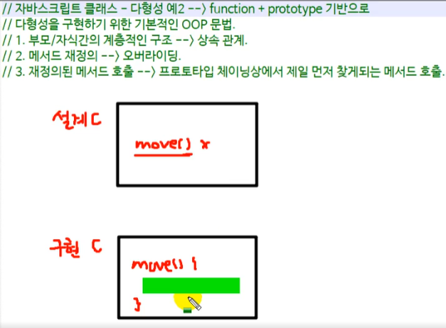

# Polymorphism
* 다형성을 구현할 순 없으나 흉내는 낼 수 있다.

## 다형성?
### [개념] 
다양한 형태를 가지는 성질

### [문법] 
어떤 기능이나 동작을 구현할 때에 `설계`적인 부분과 `구현(동작/기능)`되는 부분을 분리한다. -> 객체별로 다양하게 사용할 수 있게 하는 것.

* 부모(super) 클래스를 상속받은 자식(sub) 클래스의 인스턴스별로 적절한 메서드를 사용하는 것. 
  -> 1 : N 관계가 성립

* 즉, 부모가 잘 설계해놓은 것을 자식이 받아서 설계대로 구현한 후 각 인스턴스별로 다양하게 사용.

 
## 다형성의 예시
1. `for...of`  
다양한 자료구조에서 사용할 수 있다. -> 반복 가능한 객체 (`Array`, `String`, `Map`, `Set`...)
2. 반복문내에서 배열이나 문자열에서 동작하는 `특정 인터페이스`가 지원되는 자료구조를 사용하기 때문.
3. 컬렉션 객체가 `[Symbol.iterator]` 속성을 가지고 있어야만 한다.
4. 즉, 내가 만든 사용자 정의 객체의 경우에도 이러한 `특정 인터페이스 규격`을 맞춰준다면 사용이 가능하다.

### `for...of` vs `toString()`
#### 1. `for...of`
```js
// Array
const fruits = ['🍇', '🍈', '🍉', '🍊', '🍑', '🍏'];
for (let fruit of fruits) {
  console.log(fruit);
}

// String
const str = 'HELLO, WORLD!';
for (let word of str) {
  console.log(word);
}

// Number --> 반복 가능하지 않으므로 Error
// const num = 12345;
// for (const i of num) {
//   console.log(i);
// }

// Map
const map1 = new Map([
  ['seoul', 1],
  ['pusan', 2],
  ['jeju', 3]
]);

for (const city of map1) {
  console.log(city);
}
// ['seoul', 1]
// ['pusan', 2]
// ['jeju', 3];

for (const [key, value] of map1) {
  console.log(key, value);
}
// seoul 1
// pusan 2
// jeju 3

```

#### 2. `toString()`
모든 객체에는 객체를 텍스트 형태로 출력시키고자 할 때 자동으로 호출되는 toString() 메서드가 존재한다.  
'객체를 나타내는 문자열 반환' --> Object에서 파생된 모든 객체에 호출
```js
const dateObj = new Date(2030, 5, 25, 20, 40, 8);
strObj = dateObj.toString();
console.log(strObj);
console.log(typeof strObj); // string

console.clear();
```

#### 3. Array
```js
const arrObj = [1, 2, 3, 4, 5, 6];
console.log(arrObj.toString()); // join 처럼 행동한다.
function Person(name, age, hp, gender) {
  this.name = name;
  this.age = age;
  this.hp = hp;
  this.gender = gender;
}
const p1 = new Person('길동스', 20, 100, 'male');
console.log(p1.toString()); // [object Object]

const str1 = 'KOREA';
const iterator = str1[Symbol.iterator]();
console.log(iterator.next()); // {value: 'K', done: false}
console.log(iterator.next()); // {value: 'O', done: false}
console.log(iterator.next()); // {value: 'R', done: false}
console.log(iterator.next()); // {value: 'E', done: false}
console.log(iterator.next()); // {value: 'A', done: false}
console.log(iterator.next()); // {value: undefined, done: true}
```

```js
const str1 = 'KOREA';
const iterator = str1[Symbol.iterator](); // iterator로 만듦.

for (const i of iterator) {
  console.log(i);
}
// K
// O
// R
// E
// A
```

## interator 객체
### interator 객체의 생성
기본적으로 interable 객체 (=반복 가능한 객체)라면, Symbol.iterator 키를 가진다.

<br >

### 이터레이터 객체 직접 구현
```js
let testIterObj = {
  i: 1,
  [Symbol.iterator]: function() {
    return this;
  },
  next: function() {
    // 리턴시 next 메서드는 객체를 리턴한다.
    if (this.i < 5>) {
      return { value: this.i++, done: false };
    } else {
      return { value: undefined, done: true };
    }
  }
}
```

# 다형성 예시
* 다형성을 구현하기 위한 기본적인 OOP 문법.
  * 부모/자식간의 계층적인 구조 --> 상속 관계
  * 메서드 재정의 --> 오버라이딩
  * 재정의된 메서드 호출 --> 프로토타입 체이닝상에서 제일 먼저 찾게되는 메서드 호출
## 예시(1)
```js
class Animal {
  constructor(name) {
    this._name = name;
  }
  bark() {
    return `짖다.`;
  }
}

class Dog extends Animal {
  constructor(name, age) {
    super(name); // super가 name을 넘기면서 부모 클래스인 Animal의 constructor가 실행된다.
    this._age = age;
  }
  bark() {
    return `overiding: ${this._age}살 짜리 ${this._name}이(가) 짖다. 멍멍`;
  }
}

class Cat extends Animal {
  constructor(name, age) {
    super(name);
    this._age = age;
  }
  bark() {
    return `overiding: ${this._age}살 짜리 ${this._name}이(가) 짖다. 냐옹`;
  }
}

class Bull extends Animal {
  constructor(name, age) {
    super(name), (this._age = age);
  }
  bark() {
    return `overiding: ${this._age}살 짜리 ${this._name}이(가) 짖다. 음머`;
  }
}

// [4-2] 사용
// 배열
const animals = [new Dog('바둑', 10), new Cat('나비', 3), new Bull('보리', 6)];
for (let ani of animals) {
  console.log(ani.bark());
}
```

## 예시(2)
OOP 언어의 특징과 비슷하게..

`function` + `prototype` 기반

* 설계 class와 구현 class가 있을 경우..
  * 설계 class - 메서드 정의 (구현 class에서 메서드가 없는 경우 에러 메시지를 던져주기도 한다.)
  * 구현 class - 구체적인 메서드를 오버라이딩하여 정의한다.



### 1. 설계 클래스(인터페이스)
: 일종의 설계도 

상속을 받은 자식 클래스에서 메서드가 미구현되어져 있다면 여기서 에러를 던져준다.  
-> 그럼으로써 `강제`하는 효과가 생긴다.  
  ```js
  const Animal = function (name) {
    this._name = name;
  };

  Animal.prototype.move = function () {
    // 코드 구현...
    throw new Error('move메서드가 구현되지 않았습니다.');
  };
  ```

### 2. 구현 클래스
자식 클래스에서 move 메서드를 구현하지 않으면 부모 클래스에서 에러를 던져줌으로써 --> 구현을 강제한다.
 
  ```js
  const DogImplement = function (name, age) {
    Animal.call(this, name); // Class의 super역할
    this._age = age;
  };
  DogImplement.prototype = Object.create(Animal.prototype);
  DogImplement.prototype.constructor = DogImplement;
  // 구체적인 구현
  // -> move메서드를 정의하지 않으면, Error문이 던져짐.
  DogImplement.prototype.move = function (args) {
    console.log(`[Type: ${args}] (${this._name}, ${this._age}살) 이동중..`);
    return `멍멍!!`;
  };

  // 객체 생성하여 [5-2] 테스트하기.
  const d1 = new DogImplement('바둑이', 2);
  console.log(d1.move('갱얼쥐'));

  ```


### 3. 다형성 체크
`instanceof`  
객체가 특정 클래스의 인스턴스인지 여부를 확인.

